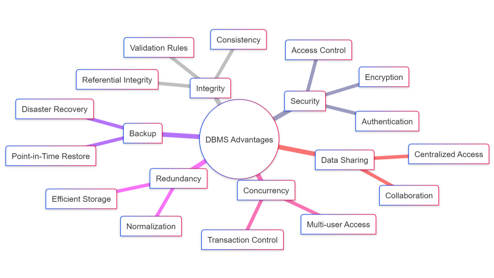

# 📘 Database Course Documentation

This repository captures important concepts from a database course. It covers the design and usage of contemporary databases, including cloud-based ones, as well as organized comparisons, diagrams, and realistic role descriptions. The aim is to increase our understanding of the functioning of databases as well as the connections between various systems and technologies.

---

## 📂 Table of Contents

1. [Relational Databases vs. Flat File Systems](#relational-databases-vs-flat-file-systems)
2. [Benefits of DBMS – Mind Map](#benefits-of-dbms--mind-map)
3. [A Description of Database Roles](#a-description-of-database-roles)
4. [Different Kinds of Databases](#different-kinds-of-databases)
5. [Cloud Databases and Storage](#cloud-databases-and-storage)
6. [Submission Checklist](#submission-checklist)
7. [List of References](#list-of-references)

---

## 🆚 Relational Databases vs. Flat File Systems

The following comparison between relational databases and flat file systems is based on redundancy, structure, relationships, applications, and downsides.

| Attribute       | Flat File Systems                                                                 | Relational Databases                                                                 |
|----------------|-------------------------------------------------------------------------------------|--------------------------------------------------------------------------------------|
| **Structure**   | Data is stored in plain text files, such as CSV files. There are no regulations or enforcement. | Utilizes a well-organized framework with tables, defined schemas, rows, and columns. |
| **Redundancy**  | Frequently includes duplicate information.                                         | The redundancy is lessened by design strategies like normalization.                  |
| **Relationships**| No built-in mechanism for data relation.                                          | Using keys (primary and foreign) to connect tables helps ensure consistency.         |
| **Usage Examples**| Perfect for straightforward jobs like logs or configs.                           | Utilized in real-world applications such as banking systems, inventory management, and e-commerce sites. |
| **Drawbacks**   | Not scalable for complicated systems and prone to mistakes.                        | Needs preparation and configuration, but far superior for managing and querying complex data. |

---

## 🧠 Benefits of DBMS – Mind Map

Databases offer far more than just storing data. Below is a mind map showing the main advantages of using a Database Management System (DBMS).

  
*Created using Mermaid Live Editor*

### Important points

- **Security**: User authentication, encryption, and access controls.  
- **Integrity**: Maintains the accuracy and consistency of data while adhering to regulations and restrictions.  
- **Backup**: Aids in recovering from disasters and returning to prior data conditions.  
- **Redundancy Control**: Prevents data from being repeated unnecessarily.  
- **Concurrency**: Enables several users to collaborate on the same data without any conflicts.  
- **Data Sharing**: Facilitates data access centrally for various users and programs.  

---

## 👥 A Description of Database Roles

Various individuals have different duties in relation to the database in a genuine project. The following is a list of who does what:

- **System Analyst**: Determines the system's requirements by interacting with users or customers, and then documents these needs in a way that is understandable to the team so that they can construct it.  
- **Database Designer**: Transforms those needs into a design, including tables, columns, relationships, and other elements.  
- **Database Developer**: Writes the real code to construct the database architecture and occasionally creates logic such as stored procedures.  
- **Database Administrator (DBA)**: Maintains the database's functionality by managing users, performing backups, maintaining security, and resolving problems.  
- **Application Developer**: Constructs the website or app that communicates with the database through queries or APIs.  
- **BI Developer**: Uses data to create dashboards and reports that aid companies in making decisions.  

---

## 🧾 Different Kinds of Databases

### 📍 Relational vs. Non-Relational

**Relational Databases**  
- Data should be kept in a well-organized format (tables with fixed columns).  
- Use SQL to retrieve or insert data.  
- Follows ACID principles (Atomicity, Consistency, Isolation, Durability).  

**Non-Relational Databases (NoSQL)**  
- More adaptable in design. Ideal for applications requiring high speeds and large data volumes.  
- Data can be stored in a variety of formats and does not need tables.  

**Typical Instances Include:**
- **MongoDB** – employs documents that resemble JSON.  
- **Cassandra** – manages vast quantities of data and is simple to scale.  

**Applications:**  
- *Relational:* Inventory, order management, and banking.  
- *Non-relational:* Social media, analytics, and CMS platforms.

---

### 📍 Centralized, Distributed, and Cloud-Based Databases

| Kind          | What It Means                                                                                  | Use Cases / Examples                                                  |
|---------------|-----------------------------------------------------------------------------------------------|------------------------------------------------------------------------|
| **Centralized** | All information is kept in one location.                                                     | Desktop applications, small business tools.                           |
| **Distributed** | Data is dispersed across several locations, yet it behaves as though it were a single system. | Enterprise systems that require high availability.                    |
| **Cloud-Based** | Hosted by services like AWS or Azure. Provides scalability, speed, and simple maintenance.   | SaaS applications, mobile backends, and global platforms requiring low latency. |

---

## ☁️ Cloud Databases and Storage

### 🔗 What is cloud storage?

Cloud storage stores data online across a network of servers, as opposed to storing it on your computer or a local server. Large corporations like Google, Microsoft, and Amazon are in charge of maintaining it.

### 🧩 What kind of database support does it offer?

Databases may grow in the cloud storage environment, and tools can be used to keep them backed up and accessible. For instance, a database may get more capacity or speedier access in the cloud without having to switch to new hardware.

### ✅ Advantages

- **Scalability**: Expands automatically as your data demands increase.  
- **Redundancy**: Redundant copies distributed throughout the area lessen downtime.  
- **Security**: Encrypted storage and access controls.  
- **Low Maintenance**: Providers manage hardware, updates, and a lot of administrative work.  
- **Affordable**: Only pay for what you use.  

### ⚠️ Cons

- **Vendor Lock-In**: It's difficult to change providers without experiencing migration problems.  
- **Internet Reliance**: Access is limited to those who have an internet connection.  
- **Additional Expenses**: Some companies charge exorbitant fees for big data transfers.  
- **Intricate Setup**: You must still be familiar with cloud technologies and best practices.  

### 💻 Model Cloud DB Platforms

| Platform          | Provider         | Features                                                                 |
|-------------------|------------------|--------------------------------------------------------------------------|
| **Amazon RDS**    | AWS              | Supports a number of well-known DB engines.                              |
| **Azure SQL**     | Microsoft Azure  | Close integration with Microsoft tools.                                  |
| **Cloud Spanner** | Google Cloud     | Designed for scalability and high worldwide consistency.                 |

---

- IBM. (2021). What is a relational database?: https://www.ibm.com/think/topics/relational-databases
- MongoDB. What is NoSQL?: https://www.mongodb.com/resources/basics/databases/nosql-explained
- Oracle Database Docs: https://docs.oracle.com/en/database/
- AWS RDS Overview: https://aws.amazon.com/rds/
- Azure SQL: https://learn.microsoft.com/en-us/azure/azure-sql/
- Google Cloud Spanner: https://cloud.google.com/spanner
